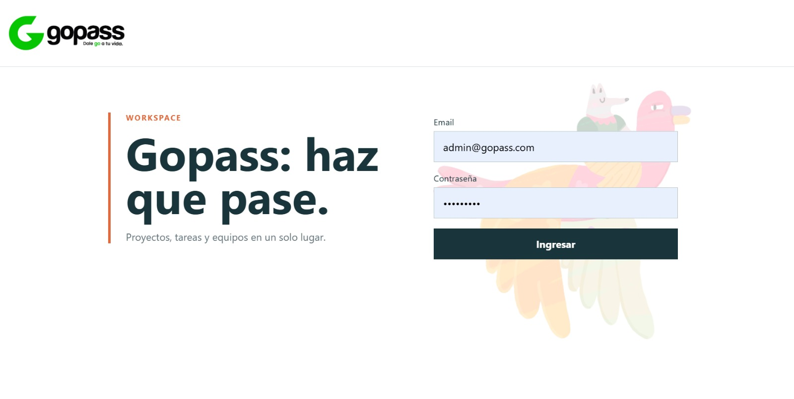

# gopass-technic-assessment

[](https://github.com/santeaponte/gopass-technic-assessment/actions/workflows/ci.yml)

Aplicacion full stack para gestionar proyectos y tareas, con autenticacion,
roles, auditoria de cambios de estado y notas por tarea.

## Demo



- **Aplicacion:** https://gopass-technic-assessment-frontend.vercel.app/

Las credenciales de acceso al entorno demo se enviaran por correo al evaluador.

## Funcionalidades

- Registro e inicio de sesion con JWT y contraseñas protegidas con bcrypt.
- Gestion de proyectos y tareas organizadas por proyecto.
- Estados, prioridades, fechas y asignacion de tareas.
- Historial de cambios de estado con usuario, fecha y comentario opcional.
- Notas asociadas a tareas.
- Autorizacion diferenciada para `ADMIN` y `VIEWER`.
- Interfaz React desplegada en Vercel y API REST desplegada en Render.

## Stack

| Capa          | Tecnologia                     |
| ------------- | ------------------------------ |
| Frontend      | React 18, TypeScript, Vite     |
| Backend       | Node.js, Express 5, TypeScript |
| Validacion    | Zod                            |
| Persistencia  | PostgreSQL, Prisma             |
| Autenticacion | JWT, bcrypt                    |
| Testing       | Vitest, Supertest, PostgreSQL  |
| CI            | GitHub Actions                 |
| Despliegue    | Vercel, Render, Supabase       |

## Arquitectura

El backend es un monolito modular organizado por dominio:

```text
HTTP Route
  -> Controller
  -> Service
  -> Repository
  -> Prisma / PostgreSQL
```

- **Routes y middleware:** autenticacion, autorizacion y validacion HTTP.
- **Controller:** adapta request/response y no contiene reglas de negocio.
- **Service:** aplica reglas de negocio, autorizacion contextual y transiciones de
  estado.
- **Repository:** unica capa que accede a Prisma y PostgreSQL.
- La instancia de Express (`app`) esta separada del listener HTTP para facilitar
  las pruebas de integracion.
- El rol y el usuario autenticados provienen del JWT, no del body enviado por
  el cliente.

### Arquitectura de despliegue

```text
Usuario
  |
Vercel - Frontend React
  | HTTPS / REST
Render - Backend Express
  | Prisma
Supabase - PostgreSQL
```

El frontend nunca accede directamente a PostgreSQL. La API centraliza la
autenticacion, autorizacion, validacion y reglas de negocio.

## Roles

| Rol      | Capacidades principales                                                                                                         |
| -------- | ------------------------------------------------------------------------------------------------------------------------------- |
| `ADMIN`  | Gestion completa de proyectos, usuarios y tareas, incluyendo asignaciones, cambios de estado y eliminacion.                     |
| `VIEWER` | Consulta de proyectos y tareas visibles, autoasignacion, notas y cambios de estado sobre tareas creadas o asignadas al usuario. |

El registro publico crea usuarios `VIEWER`. Los usuarios `ADMIN` se crean
mediante el seed configurado por variables de entorno.

## Modelo de datos

- `User`: identidad, credenciales, rol y estado de activacion.
- `Project`: proyecto, propietario, estado, prioridad y fechas.
- `Task`: tarea, proyecto, creador, asignado, prioridad, estado y fechas.
- `TaskStatusChange`: historial auditable de transiciones de estado.
- `TaskNote`: notas con autor y timestamps.

Relaciones principales:

```text
User 1---N Project        (owner)
Project 1---N Task
User 1---N Task            (creator)
User 1---N Task            (assignee, optional)
Task 1---N TaskStatusChange
User 1---N TaskStatusChange (changedBy)
Task 1---N TaskNote
User 1---N TaskNote         (author)
```

## Decisiones tecnicas

- **Monolito modular en lugar de microservicios:** el alcance no requiere
  despliegues independientes y esta estructura mantiene separadas las
  responsabilidades.
- **Autorizacion en backend:** las protecciones de rutas del frontend solo
  controlan la experiencia; la seguridad real se aplica con JWT y middleware.
- **Auditoria de estados:** el historial se persiste como entidad propia para
  conservar quien hizo cada cambio, cuando y con que comentario.
- **Asignacion 1:N:** cada tarea tiene un unico responsable opcional. Una
  relacion N:N seria una evolucion posible si el negocio requiere varios.
- **PostgreSQL real en integracion:** permite validar transacciones, relaciones
  y restricciones que los mocks no cubren.

## Ejecucion local

### Requisitos

- Node.js 20 o superior.
- Docker Desktop con Docker Compose.

### Docker Compose

```bash
docker compose up --build
```

Servicios:

- Frontend: http://localhost:8080
- API: http://localhost:4000
- Documentacion Swagger: http://localhost:4000/api-docs

Para detener los servicios:

```bash
docker compose down
```

Para eliminar tambien los datos locales:

```bash
docker compose down -v
```

### Seed del administrador

El seed de Prisma es idempotente y usa estas variables:

```bash
ADMIN_EMAIL="admin@example.com"
ADMIN_PASSWORD="cambia-esto-min-8-caracteres"
ADMIN_NAME="Admin"
```

Los valores son ejemplos para desarrollo local. Si no se definen `ADMIN_EMAIL`
o `ADMIN_PASSWORD`, el seed no crea ningun administrador.

## Variables de entorno

Backend:

```bash
DATABASE_URL=postgresql://...
JWT_SECRET=...
JWT_EXPIRES_IN=1d
CORS_ORIGIN=http://localhost:8080
ADMIN_EMAIL=...
ADMIN_PASSWORD=...
ADMIN_NAME=Admin
```

Frontend:

```bash
VITE_API_URL=http://localhost:4000
```

`prisma.config.ts` utiliza `DATABASE_URL` como unica conexion configurada para
Prisma.

## API

La especificacion OpenAPI esta disponible en `/api-docs`.

| Recurso     | Operaciones principales                           |
| ----------- | ------------------------------------------------- |
| `/auth`     | Registro e inicio de sesion                       |
| `/users`    | Consulta y gestion administrativa de usuarios     |
| `/projects` | Listado, creacion, actualizacion y eliminacion    |
| `/tasks`    | Listado, creacion, actualizacion, estados y notas |
| `/health`   | Health check de la API                            |

Las operaciones protegidas requieren un token Bearer. Los permisos dependen del
rol y de las reglas del recurso.

## Testing y calidad

La suite se divide en:

1. **Schemas:** validacion de payloads, UUID, fechas y enums.
2. **Unit tests:** servicios con repositories mockeados.
3. **Integration tests:** Express, middleware, servicios, repositories, Prisma y
   PostgreSQL real.

Los tests de integracion usan la base aislada `gopass_test`, nunca la base de
desarrollo.

Desde `backend/`:

```bash
npm install
npm run test:db:setup
npm run test:unit
npm run test:integration
npm test
npm run build
npm run lint
```

Los comandos `test:unit` y `test:integration` ejecutan cada grupo de forma
explícita; `npm test` conserva la configuración general de Vitest para los tests
unitarios.

Desde `frontend/`:

```bash
npm install
npm run build
npm run lint
```

La cobertura se puede consultar con:

```bash
cd backend
npx vitest run --coverage
```

La cobertura se interpreta junto con el alcance de las pruebas; no se agregan
casos artificiales solo para aumentar un porcentaje.

## Integracion continua

GitHub Actions valida en cada `push` y `pull_request`:

- Generacion del cliente Prisma.
- Creacion y migracion de `gopass_test`.
- Tests unitarios e integracion HTTP.
- Build y lint del backend.
- Build y lint del frontend.

Workflow: [`.github/workflows/ci.yml`](.github/workflows/ci.yml).

## Mejoras futuras

- Adjuntos de imagenes, PDFs y otros archivos en proyectos y tareas.
- Almacenamiento de objetos con Supabase Storage o S3.
- Metadatos, limites, validacion MIME, URLs firmadas y permisos por archivo.
- Previsualizacion de imagenes y PDFs.
- Auditoria de subida, reemplazo y eliminacion de archivos.
- Mayor cobertura del modulo `Users`.
- Notificaciones para asignaciones, notas y cambios de estado.
- Asignacion multiple mediante una relacion N:N si el negocio lo requiere.
